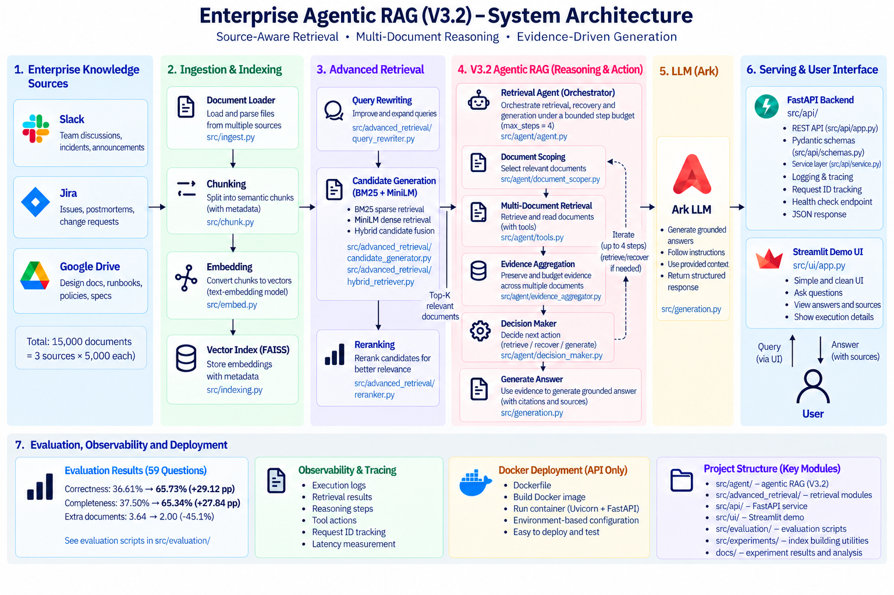
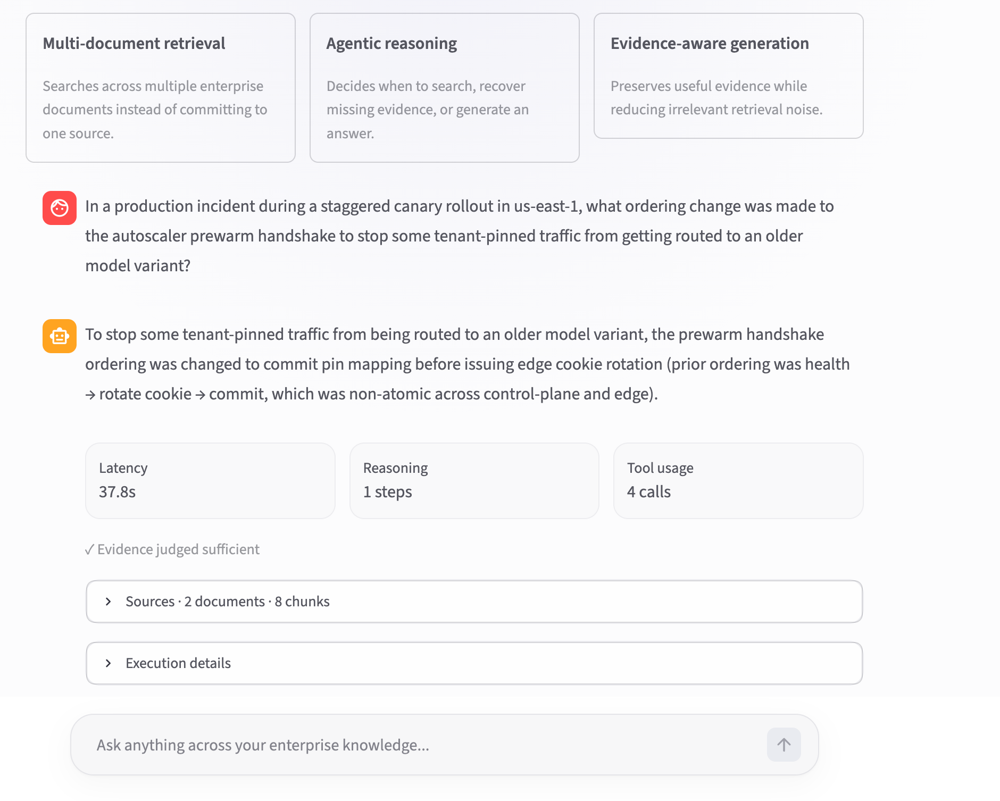

# Enterprise Agentic RAG

A production-oriented **Agentic RAG system for enterprise knowledge retrieval**, built with source-aware retrieval, multi-document reasoning, evidence recovery, FastAPI, Docker, and a Streamlit demo.

The project was developed on a local enterprise corpus of **15,000 documents** from Slack, Jira, and Google Drive. Starting from a basic RAG baseline, the system was iteratively improved through retrieval evaluation, failure analysis, controlled experiments, and agentic recovery.

On a **59-question corpus-covered evaluation subset**, the final V3.2 system improved answer correctness from **36.61% to 65.73%** while reducing irrelevant extra documents by approximately **45%**.

## Results

| Metric | V1 Advanced RAG | V3.2 Agentic RAG | Change |
|---|---:|---:|---:|
| Correctness | 36.61% | **65.73%** | **+29.12 pp** |
| Completeness | 37.50% | **65.34%** | **+27.84 pp** |
| Document Recall | 74.58% | **74.58%** | unchanged |
| Extra Documents | 3.64 | **2.00** | **-45.1%** |

A key finding was that **document recall was already much higher than answer correctness**.

The correct source was often retrieved, but the system still failed because it committed too early to one document, selected semantically similar but non-answer-bearing evidence, or lost useful evidence during later retrieval steps.

This shifted the optimization target from simply retrieving more documents to **better source selection, evidence preservation, and bounded recovery**.

## System Architecture



The final system consists of four major layers:

**Ingestion and indexing**

Enterprise documents are loaded, chunked with metadata, embedded, and stored in a FAISS vector index.

**Advanced retrieval**

Queries pass through query rewriting and hybrid candidate generation using:

- BM25 sparse retrieval
- MiniLM dense retrieval
- hybrid candidate fusion
- Cross-Encoder reranking

**V3.2 Agentic RAG**

A retrieval agent orchestrates the reasoning loop:

```text
Question
   ↓
Candidate Retrieval
   ↓
Document Scoping
   ↓
Multi-Document Retrieval
   ↓
Evidence Aggregation
   ↓
Decision Maker
   ↓
Enough evidence?
   ├── Yes → Generate Answer
   └── No  → Recover Evidence → Iterate
```

The agent operates under a bounded **maximum of 4 steps**, preventing uncontrolled retrieval loops.

**Serving**

The frozen V3.2 pipeline is exposed through:

```text
Streamlit Demo UI
        ↓
FastAPI REST API
        ↓
RAG Service
        ↓
V3.2 Retrieval Agent
        ↓
Retrieval + LLM
```

The API includes request tracing, latency measurement, structured responses, health checking, and sanitized error handling.

## Demo



Example production-style query:

> In a production incident during a staggered canary rollout in us-east-1, what ordering change was made to the autoscaler prewarm handshake to stop some tenant-pinned traffic from getting routed to an older model variant?

For this run, the system:

- completed the reasoning process in **1 step**
- made **4 tool calls**
- used evidence from **2 documents / 8 chunks**
- judged the retrieved evidence **sufficient**
- returned the grounded answer in **37.8 seconds**

The demo exposes both the final answer and execution metadata so the retrieval process is inspectable rather than being a black-box generation call.

## Why Agentic RAG?

The initial failure analysis revealed an important gap:

```text
Document Recall: 74.58%
Answer Correctness: 36.61%
```

Retrieving the correct document was therefore **not sufficient**.

Several failure cases showed that relevant documents existed in the candidate pool, but the system could still:

1. commit prematurely to a single document,
2. prefer semantic hard negatives,
3. retrieve the correct source but miss the answer-bearing chunk,
4. replace useful evidence during recovery.

V3 introduced **source-aware reasoning** to address these failures.

Instead of treating retrieval as a single Top-K operation, the system first reasons about **which documents should be searched**, then retrieves evidence within those sources.

The core design principle became:

> **Source first → Evidence second**

## V3.2 Agent Design

### Document Scoping

`DocumentScoper` identifies relevant candidate documents before local evidence retrieval.

This reduces premature commitment to whichever chunk happens to receive the highest initial similarity score.

### Multi-Document Retrieval

The agent can retrieve evidence from multiple selected documents instead of forcing the entire answer through one source.

This is especially important for enterprise questions whose evidence may be distributed across incident reports, discussions, tickets, and design documents.

### Evidence Aggregation

Retrieved evidence is preserved and budgeted across documents.

V3.2 uses **recovery-aware evidence budgeting**: when the agent deliberately selects a new document to resolve missing information, that recovery source receives a larger share of the evidence budget while representative evidence from previous sources is retained.

This prevents newly retrieved evidence from simply displacing useful context.

### Decision Maker

The `DecisionMaker` chooses the next action based on the current evidence state:

```text
retrieve
recover
generate
```

The loop is bounded to avoid unnecessary tool calls and reasoning drift.

Experiments with a larger step budget did not improve results consistently, reinforcing that **more agent steps do not automatically produce better answers**.

## Evolution

The project was developed incrementally rather than starting with an agent architecture.

| Version | Main Focus |
|---|---|
| V0 | Basic RAG baseline |
| V1 | Hybrid retrieval, reranking, end-to-end evaluation |
| V2 | Agent controller and evidence-aware recovery experiments |
| V3.0 | Multi-document scoping |
| V3.1 | Source-aware evidence preservation |
| **V3.2** | **Recovery-aware evidence budgeting + bounded agent loop** |

Each architectural change was driven by observed failure cases rather than added solely for complexity.

Detailed experiment notes are available in:

- `docs/v0_failure_analysis.md`
- `docs/v1_experiments.md`
- `docs/v1_end_to_end_failure_analysis.md`
- `docs/v2_agent_experiments.md`
- `docs/v3_agent_experiments.md`

## Evaluation Methodology

The local corpus contains:

```text
15,000 enterprise documents

├── Slack        5,000
├── Jira         5,000
└── Google Drive 5,000
```

The final end-to-end evaluation uses **59 questions whose required documents are fully represented in the local corpus**.

The evaluation measures:

- answer correctness
- answer completeness
- document recall
- invalid extra documents
- generation latency

This subset should not be interpreted as the full EnterpriseRAG-Bench benchmark. It is a **corpus-covered evaluation subset** used for controlled comparison of the project's retrieval and agent architectures.

One particularly useful result was:

```text
V1
Document Recall = 74.58%
Correctness     = 36.61%

V3.2
Document Recall = 74.58%
Correctness     = 65.73%
```

Because document recall remained unchanged while answer quality improved substantially, the gain is primarily associated with **better routing and evidence utilization rather than simply retrieving more gold documents**.

## API

The system exposes the frozen V3.2 pipeline through FastAPI.

### Health Check

```http
GET /health
```

Example response:

```json
{
  "status": "ok",
  "service": "enterprise-agentic-rag",
  "version": "v3.2",
  "rag_loaded": true
}
```

### Query

```http
POST /query
Content-Type: application/json
```

Request:

```json
{
  "question": "Your enterprise knowledge question"
}
```

The response includes:

```json
{
  "answer": "...",
  "sources": [],
  "decision_steps": 1,
  "tool_actions": 4,
  "latency_seconds": 37.8,
  "request_id": "...",
  "evidence_sufficient": true
}
```

This provides both the generated answer and metadata needed for debugging and observability.

## Observability

The API records structured execution information including:

- request ID
- request lifecycle
- retrieval execution
- reasoning steps
- tool actions
- evidence sufficiency
- source count
- end-to-end latency
- server-side exceptions

Client-facing failures return stable, sanitized HTTP errors while detailed exceptions remain in server logs.

## Docker

The FastAPI service can be packaged into a reproducible Docker image.

Build:

```bash
docker build -t enterprise-agentic-rag:prod .
```

Run:

```bash
docker run \
  --name enterprise-rag-api \
  --env-file .env \
  -p 8000:8000 \
  enterprise-agentic-rag:prod
```

The container starts Uvicorn automatically and serves the FastAPI application on port `8000`.

Secrets are injected at runtime rather than copied into the image.

> The current Docker image packages the FastAPI backend. The Streamlit demo is run separately.

## Local Development

### 1. Clone

```bash
git clone https://github.com/mingyangzhang-Eden/enterprise-agentic-rag.git
cd enterprise-agentic-rag
```

### 2. Create a virtual environment

```bash
python -m venv .venv
source .venv/bin/activate
```

### 3. Install dependencies

```bash
pip install -r requirements-api.txt
```

### 4. Configure environment variables

Create a local `.env` file with the required LLM configuration.

```text
ARK_API_KEY=...
ARK_BASE_URL=...
ARK_LLM_ENDPOINT_ID=...
ARK_CONTROLLER_ENDPOINT_ID=...
ARK_JUDGE_ENDPOINT_ID=...
```

The `.env` file is excluded from version control.

### 5. Start the API

```bash
PYTHONPATH=src uvicorn api.app:app --reload
```

Then open:

```text
http://127.0.0.1:8000/docs
```

### 6. Start the Demo UI

In another terminal:

```bash
python -m streamlit run src/ui/app.py
```

The Streamlit demo communicates with the FastAPI backend.

## Project Structure

```text
enterprise-agentic-rag/
├── src/
│   ├── agent/                  # V3.2 Agentic RAG
│   │   ├── agent.py
│   │   ├── decision_maker.py
│   │   ├── document_scoper.py
│   │   ├── evidence_aggregator.py
│   │   ├── state.py
│   │   └── tools.py
│   │
│   ├── advanced_retrieval/     # Advanced retrieval pipeline
│   │   ├── bm25_retriever.py
│   │   ├── bge_retriever.py
│   │   ├── hybrid_retriever.py
│   │   ├── candidate_generator.py
│   │   ├── query_rewriter.py
│   │   └── reranker.py
│   │
│   ├── api/                    # FastAPI serving layer
│   │   ├── app.py
│   │   ├── schemas.py
│   │   └── service.py
│   │
│   ├── ui/
│   │   └── app.py              # Streamlit demo
│   │
│   ├── evaluation/             # Evaluation and diagnostics
│   ├── experiments/            # Index/retrieval experiments
│   ├── ingest.py
│   ├── chunk.py
│   ├── embed.py
│   ├── indexing.py
│   └── generation.py
│
├── docs/
│   ├── assets/
│   │   ├── system_architecture.png
│   │   └── demo_ui.png
│   ├── v0_failure_analysis.md
│   ├── v1_experiments.md
│   ├── v1_end_to_end_failure_analysis.md
│   ├── v2_agent_experiments.md
│   └── v3_agent_experiments.md
│
├── Dockerfile
├── requirements.txt
├── requirements-api.txt
└── README.md
```

## Tech Stack

**Retrieval & ML**

- Python
- FAISS
- BM25
- MiniLM embeddings
- Sentence Transformers
- Cross-Encoder reranking
- PyTorch / Transformers

**Agent & Generation**

- custom retrieval agent
- source-aware document scoping
- multi-document retrieval
- recovery-aware evidence aggregation
- Ark LLM

**Serving & Demo**

- FastAPI
- Pydantic
- Uvicorn
- Streamlit
- Docker

## Key Engineering Lessons

Three lessons shaped the final architecture.

**1. Retrieval recall is not answer quality.**

A system can retrieve the correct document and still fail if it selects the wrong evidence inside that document.

**2. Semantic similarity is not the same as answer-bearing evidence.**

Highly similar chunks can become semantic hard negatives and dominate retrieval despite not containing the required facts.

**3. More agent steps are not always better.**

Increasing the reasoning budget can introduce retrieval drift. A bounded loop with targeted recovery performed better than unrestricted iteration.

These findings led to the final V3.2 architecture: **source-aware routing, multi-document retrieval, evidence preservation, and bounded recovery**.

## Limitations

- The reported evaluation covers 59 fully corpus-covered questions rather than the complete EnterpriseRAG-Bench corpus.
- The local knowledge base contains 15,000 documents from three enterprise source types.
- End-to-end latency remains relatively high because a query may involve retrieval, reranking, multiple agent decisions, and LLM calls.
- The current Docker image serves the API backend; the Streamlit demo is run separately.
- The system is designed as a portfolio-scale production architecture rather than a horizontally scaled multi-tenant deployment.

## License

This project is licensed under the terms of the repository's `LICENSE` file.